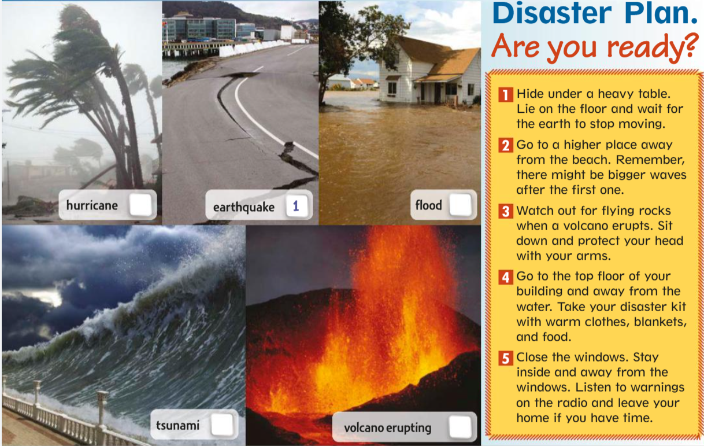

## Lesson Overview
**Content**: talking about a disaster plan. 

In this lesson, you are going to learn various words to describe natural disasters and how to prepare or escape one if it happen.



<!-- ## Vocabulary List
* **Special powers** — *Noun*: abilities that normal people do not have
* **Brave** — *Adjective*: not afraid of danger
* **Invisible** — *Adjective*: cannot be seen
* **Control minds** — *Verb phrase*: to control what others think or do
* **Intelligent** — *Adjective*: very smart
* **Villains** — *Noun*: bad people or characters
* **Secret identity** — *Noun*: a hidden real identity -->

## Vocabulary List

```{=html}
<script>
function playAudio(id) {
  // Stop all other audio players
  document.querySelectorAll("audio").forEach(audio => {
    audio.pause();
    audio.currentTime = 0;
  });
  // Play the selected audio
  const audio = document.getElementById(id);
  if (audio) {
    audio.play().catch(err => {
      console.error('Audio playback failed:', err);
      console.log('Audio src:', audio.src);
    });
  } else {
    console.error('Audio element not found:', id);
  }
}
</script>

<ul class="vocab-list">

<li class="vocab-item">
<button class="play-btn" onclick="playAudio('hur')">🔊</button>
<b>Hurricane</b> /ˈhɜːrɪkeɪn/ — <i>Noun</i>: a violent storm with very strong winds and heavy rain
<audio id="hur" src="audio/hurricane.mp3"></audio>
</li>

<li class="vocab-item">
<button class="play-btn" onclick="playAudio('eq')">🔊</button>
<b>Earthquake</b> /ˈɜːrθkweɪk/ — <i>Noun</i>: a sudden shaking of the ground
<audio id="eq" src="audio/earthquake.mp3"></audio>
</li>

<li class="vocab-item">
<button class="play-btn" onclick="playAudio('fld')">🔊</button>
<b>Flood</b> /flʌd/ — <i>Noun</i>: water covering land that is usually dry
<audio id="fld" src="audio/flood.mp3"></audio>
</li>

<li class="vocab-item">
<button class="play-btn" onclick="playAudio('tsu')">🔊</button>
<b>Tsunami</b> /tsuːˈnɑːmi/ — <i>Noun</i>: a huge ocean wave caused by an underwater earthquake
<audio id="tsu" src="audio/tsunami.mp3"></audio>
</li>

<li class="vocab-item">
<button class="play-btn" onclick="playAudio('vol')">🔊</button>
<b>Volcano Erupting</b> /vɒlˈkeɪnoʊ ɪˈrʌptɪŋ/ — <i>Phrase</i>: when a volcano explodes and releases lava, ash, and gas
<audio id="vol" src="audio/volcano-erupting.mp3"></audio>
</li>

<li class="vocab-item">
<button class="play-btn" onclick="playAudio('pro')">🔊</button>
<b>Protect</b> /prəˈtekt/ — <i>Verb</i>: to keep someone or something safe from harm
<audio id="pro" src="audio/protect.mp3"></audio>
</li>

<li class="vocab-item">
<button class="play-btn" onclick="playAudio('shk')">🔊</button>
<b>Shake</b> /ʃeɪk/ — <i>Verb</i>: to move suddenly back and forth
<audio id="shk" src="audio/shake.mp3"></audio>
</li>

<li class="vocab-item">
<button class="play-btn" onclick="playAudio('war')">🔊</button>
<b>Warning</b> /ˈwɔːrnɪŋ/ — <i>Noun</i>: a message that tells people about danger
<audio id="war" src="audio/warning.mp3"></audio>
</li>

</ul>
```


## Example Sentences
1. The hurricane damaged many houses near the coast.
2. An earthquake shook the city early this morning.
3. Heavy rain caused a flood in the village.
4. The tsunami reached the shore very quickly.
5. The volcano is erupting and people are leaving the area.
6. Parents protect their children during dangerous situations.
7. The windows shake when a big truck passes by.
8. The warning helped people move to a safe place.

## Practice Activity

[🔗: Exercise_Link](e1.qmd)


