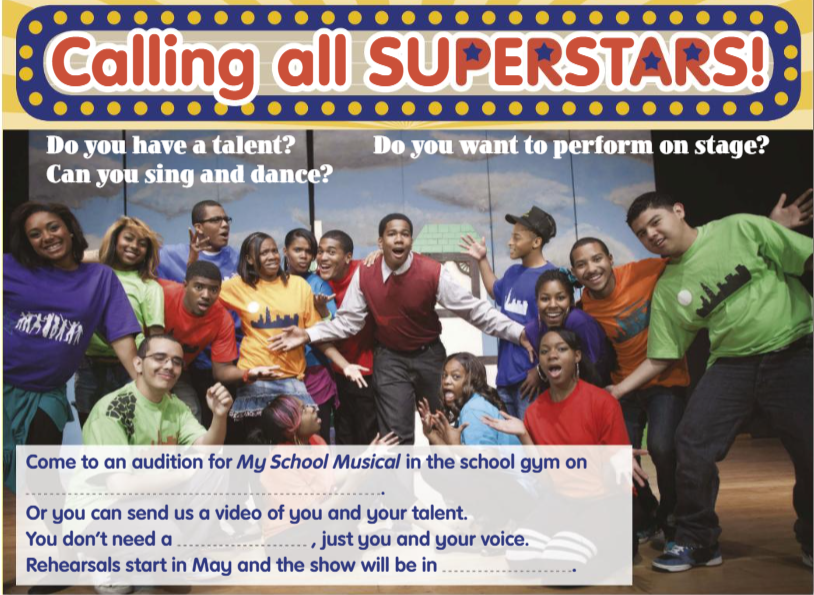

## Lesson Overview
**Content**: In this lesson, we will explore the world of superstars and their talents. We will learn how to describe their skills, performances, and the impact they have on their audiences.




## Vocabulary List

```{=html}
<script>
function playAudio(id) {
  // Stop all other audio players
  document.querySelectorAll("audio").forEach(audio => {
    audio.pause();
    audio.currentTime = 0;
  });
  // Play the selected audio
  const audio = document.getElementById(id);
  if (audio) {
    audio.play().catch(err => {
      console.error('Audio playback failed:', err);
      console.log('Audio src:', audio.src);
    });
  } else {
    console.error('Audio element not found:', id);
  }
}
</script>

<ul class="vocab-list">

<li class="vocab-item">
<button class="play-btn" onclick="playAudio('sp')">🔊</button>
<b>Musical</b> <i>Adjective</i>: Related to or connected with music.<audio id="sp" src="audio/musical.mp3"></audio>
</li>

<li class="vocab-item">
<button class="play-btn" onclick="playAudio('audition')">🔊</button>
<b>Audition</b> <i>Noun</i>: A short performance to show your skills and try to get a role in a show, band, or competition.<audio id="audition" src="audio/audition.mp3"></audio>
</li>

<li class="vocab-item">
<button class="play-btn" onclick="playAudio('perform')">🔊</button>
<b>Perform</b> <i>Verb</i>: To do or carry out an action, especially a skill or task.<audio id="perform" src="audio/perform.mp3"></audio>
</li>

<li class="vocab-item">
<button class="play-btn" onclick="playAudio('stage')">🔊</button>
<b>Stage</b> <i>Noun</i>: A place where performances are given.<audio id="stage" src="audio/stage.mp3"></audio>
</li>

<li class="vocab-item">
<button class="play-btn" onclick="playAudio('rehearsal')">🔊</button>
<b>Rehearsal</b> <i>Noun</i>: A practice session before a performance.<audio id="rehearsal" src="audio/rehearsal.mp3"></audio>
</li>

<li class="vocab-item">
<button class="play-btn" onclick="playAudio('voice')">🔊</button>
<b>Voice</b> <i>Noun</i>: The sound of a person speaking or singing.<audio id="voice" src="audio/voice.mp3"></audio>
</li>

<li class="vocab-item">
<button class="play-btn" onclick="playAudio('superstar')">🔊</button>
<b>Superstar</b> <i>Noun</i>: A famous person who is admired by many people.<audio id="superstar" src="audio/superstar.mp3"></audio>
</li>

<li class="vocab-item">
<button class="play-btn" onclick="playAudio('talent')">🔊</button>
<b>Talent</b> <i>Noun</i>: A natural ability or skill.<audio id="talent" src="audio/talent.mp3"></audio>
</li>

</ul>
```


## Example Sentences
1. She has a musical talent that allows her to play the piano beautifully.
2. He is going to audition for the school play next week.
3. They will perform on stage at the talent show.
4. The rehearsal for the concert is scheduled for tomorrow.
5. Her voice is so powerful that it captivates the audience.
6. The superstar received a standing ovation after her performance.
7. He has a natural talent for singing and dancing.

## Practice Activity

🔗: Exercise_Link (Under Construction)


